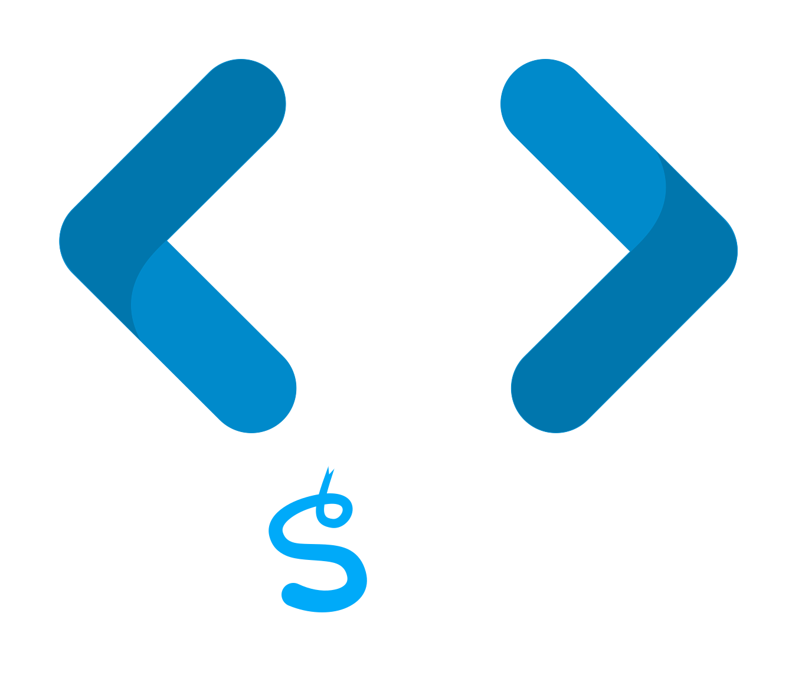

# EasyApp Chrome Extension 🚀

<p align="center">
  
</p>

Welcome to **EasyApp**, your one-stop solution for navigating job listings with ease. Job hunting has never been this effortless!

## Table of Contents

- [Features](#features)
- [Getting Started](#getting-started)
  - [Installation](#installation)
- [Dive into Chrome Extensions](#dive-into-chrome-extensions)
- [License](#license)

## Features

- **Autofill Page**: Instantly fill out job application forms.
- **Navigate Listings**: Manage and navigate through your job listings.
- **Settings**: Customize your personal info for EasyApp to use.

## Getting Started

### Installation

1. Clone this repository:
   ```bash
   git clone https://github.com/yourusername/easyapp-extension.git
   ```
2. Open Chrome and navigate to `chrome://extensions/`.
3. Enable "Developer mode" (usually a toggle in the top right).
4. Click on "Load unpacked" and select the directory where you cloned the repository.
5. The **EasyApp** extension icon should now appear in your Chrome toolbar. Click on it and enjoy!

## Dive into Chrome Extensions

If you're new to Chrome extensions, here are some resources to get you started:

- [Official Chrome Extensions Documentation](https://developer.chrome.com/docs/extensions/mv3/getstarted/)
- [Chrome Extension Development for Beginners](https://www.smashingmagazine.com/2017/04/browser-extension-edge-chrome-firefox-opera-brave-vivaldi/)

## License

This project is licensed under the MIT License. See the [LICENSE](LICENSE) file for details.

A [Rensselaer Center for Open Source](https://new.rcos.io/) project
